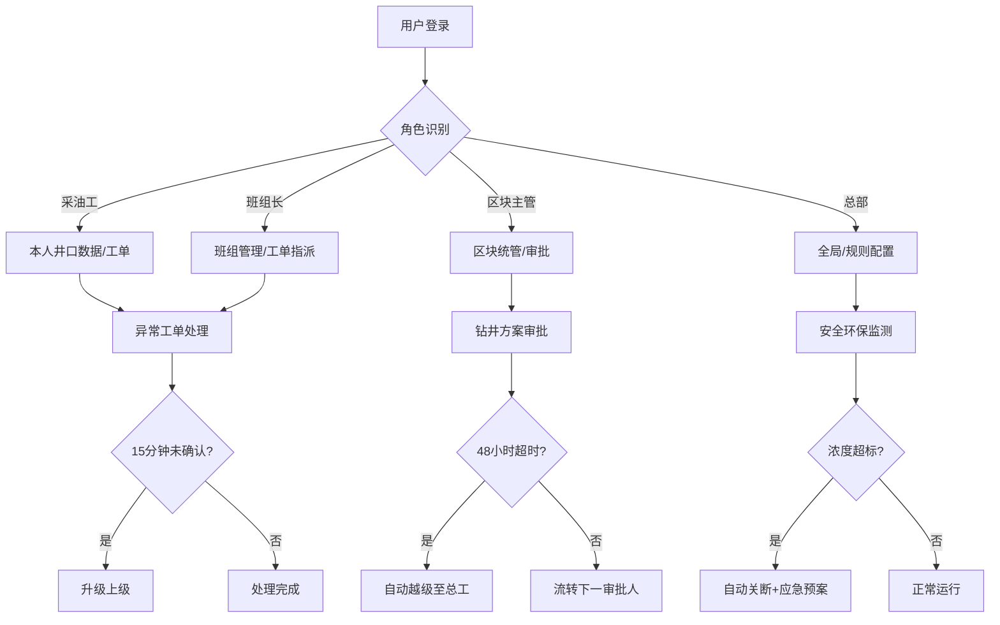

# 油田企业综合管理系统 - 产品需求文档 (PRD)

## 1. 产品概述
面向大型油田企业的全链路智能管理平台，整合地质勘探、钻井调度、采油监控、油品储运、设备运维与安全环保六大核心业务。通过智能化算法、实时数据采集和多级审批机制，实现油田生产全流程的数字化管控与智能决策。

- **目标用户**：油田总部管理员、区块主管、班组长、采油工、地质专家、总工、物供经理、安全专员等
- **核心价值**：提升生产效率30%+，降低安全事故率80%，缩短决策周期，实现全链路可视化管控

---

## 2. 核心功能

### 2.1 用户角色与权限

| 角色 | 注册方式 | 核心权限 | 权限范围 |
|------|---------|---------|---------|
| 采油工 | 系统分配 | 查看本人负责井位数据、确认工单、提交巡检记录 | 仅本人负责的井口 |
| 班组长 | 系统分配 | 管理班组工单、指派任务、查看班组井位数据、审批班组级事项 | 本班组所有井口 |
| 区块主管 | 系统分配 | 统管区块所有业务、审批钻井方案、审核采购申请、查看区块报表 | 所属区块全部数据 |
| 总部管理员 | 系统分配 | 全局规则配置、用户管理、系统参数调整、查看全油田数据 | 全局 |
| 地质专家 | 系统分配 | 审批钻井井位方案、查看地质数据 | 地质勘探模块 |
| 总工程师 | 系统分配 | 终审钻井方案、越级审批超期事项 | 全局技术审批 |

### 2.2 功能模块

1. **首页大屏**：区块产量统计、井口完好率、储罐液位监控、实时预警时间轴、区块筛选、月度报告导出
2. **地质勘探**：三维地质模型可视化、智能井位推荐、两级审批流程（专家→总工，超48h越级）
3. **钻井调度**：钻机状态管理、物料库存监控、自动排程、采购预警与审批（主管→物供经理）
4. **采油监控**：5秒级传感器数据采集（油压、温度）、异常工单自动生成、紧急程度分级指派、15分钟未确认升级
5. **油品储运**：罐车智能调度、最优路线规划、司机接单实时追踪、超时2小时自动转派
6. **设备运维**：周期巡检计划、故障报修班组匹配、2小时未接单升级、修复后照片上传验证
7. **安全环保**：泄漏/可燃气体实时监测、超标自动关断、应急预案推送、事故追溯
8. **系统管理**：四级权限配置、用户管理、规则参数调整、操作日志

### 2.3 页面详情

| 页面名称 | 模块名称 | 功能描述 |
|---------|---------|---------|
| 登录页 | 身份认证 | 账号密码登录、角色自动识别、权限路由拦截 |
| 首页大屏 | 产量仪表盘 | 各区块日/月/年产量对比柱状图，5秒刷新 |
| 首页大屏 | 井口完好率 | 各区块完好率环形进度图，点击下钻详情 |
| 首页大屏 | 储罐液位 | 所有储罐实时液位条形图，低于/超过阈值变色告警 |
| 首页大屏 | 预警时间轴 | 按时间倒序展示所有预警，支持级别筛选 |
| 首页大屏 | 区块筛选器 | 下拉选择区块，联动所有图表数据 |
| 首页大屏 | 报告导出 | 一键导出月度Excel/PDF分析报告 |
| 地质勘探 | 三维模型 | WebGL渲染地质层3D模型，支持旋转/缩放/剖切 |
| 地质勘探 | 井位推荐 | AI推荐井位列表，显示预测产量、风险等级 |
| 地质勘探 | 审批流 | 审批状态流转、倒计时、超期自动越级处理 |
| 钻井调度 | 排程甘特图 | 钻机任务时间轴，拖拽调整，冲突检测 |
| 钻井调度 | 库存看板 | 关键物资库存、安全线标记、低库存自动预警 |
| 钻井调度 | 采购审批 | 采购申请单流转，物供经理审批界面 |
| 采油监控 | 实时曲线 | 油压/温度5秒级实时折线图，阈值标记线 |
| 采油监控 | 工单中心 | 异常工单列表，紧急程度彩色标签，15分钟升级倒计时 |
| 油品储运 | 调度地图 | 地图上展示罐车位置、路线、配送进度 |
| 油品储运 | 转派记录 | 超时2小时自动转派日志，可追溯 |
| 设备运维 | 巡检日历 | 周期巡检计划日历视图，完成状态标记 |
| 设备运维 | 报修工单 | 故障报修，2小时未接单升级，修复照片上传 |
| 安全环保 | 监测仪表盘 | 泄漏/可燃气体浓度实时数据，超标红色闪烁 |
| 安全环保 | 应急预案 | 超标触发应急预案，步骤指导，关断状态确认 |
| 系统管理 | 用户权限 | 用户增删改、角色分配、权限矩阵配置 |
| 系统管理 | 规则配置 | 审批超时时间、阈值参数、升级规则全局调整 |

---

## 3. 核心流程

### 3.1 钻井方案审批流程
```
AI推荐井位 → 提交钻井方案 → 地质专家审批 
    → [48h内审批通过/驳回] → 总工程师终审 → 通过/驳回
    → [超时48h未处理] → 自动越级至总工审批
```

### 3.2 采油异常处理流程
```
传感器5秒采集 → 异常检测触发 → 自动生成工单（按紧急程度分级）
    → 指派对应班组 → 15分钟内确认接单
        → [确认] → 处理 → 关闭工单
        → [超时15min未确认] → 升级至班组长/区块主管
```

### 3.3 罐车调度转派流程
```
订单生成 → 库存匹配 → 最优路线规划 → 指派司机
    → 司机接单 → 实时GPS追踪
        → [正常送达] → 签收完成
        → [超时2h未完成] → 自动转派其他司机
```

### 3.4 安全应急流程
```
可燃/泄漏传感器监测 → 浓度超标阈值触发
    → 自动关断阀门 → 推送应急预案至相关人员
    → 启动应急疏散/处置流程 → 处理完成恢复生产
```



---

## 4. 用户界面设计

### 4.1 设计风格
- **工业科技风**：深色主题（深蓝+炭灰基底），搭配科技蓝(#00D4FF)高亮、琥珀橙(#FFA500)告警、危险红(#FF3B3B)警报
- **主色调**：#0A1628（深蓝黑背景）、#112240（面板背景）、#00D4FF（主强调色）
- **辅色调**：#00FF88（正常状态）、#FFA500（警告状态）、#FF3B3B（危险状态）
- **按钮风格**：扁平化带微光边框，悬停时发光动效，圆角4px
- **字体**：标题使用 Rajdhani 等宽科技感字体，正文使用系统默认
- **布局**：顶部导航栏 + 左侧功能菜单 + 右侧内容区，卡片式布局
- **图标**：Lucide图标库，配合发光效果
- **动效**：数据刷新脉冲动画、预警闪烁、进度条渐变流动

### 4.2 页面设计概览

| 页面名称 | 模块名称 | UI元素 |
|---------|---------|---------|
| 登录页 | 身份认证 | 全屏油田背景图 + 磨砂玻璃登录卡片，科技蓝渐变按钮 |
| 首页大屏 | 数据仪表盘 | 4个区块产量卡片环形展示，中央大屏实时数据，右侧预警时间轴滚动 |
| 首页大屏 | 图表区 | ECharts柱状图/折线图/环形图，深色背景+荧光色数据线 |
| 地质勘探 | 3D模型区 | 全屏WebGL画布，左侧控制面板，井位热点标记 |
| 钻井调度 | 甘特图 | 时间轴横向排布，钻机行纵向排列，拖拽交互 |
| 采油监控 | 实时曲线 | 多Y轴折线图，数据点脉冲动画，阈值虚线标记 |
| 安全环保 | 监测面板 | 模拟仪表盘组件，指针旋转，超标时边框红光闪烁 |

### 4.3 响应式设计
- **设计原则**：桌面端优先（Dashboard类应用），适配1920×1080及以上
- **断点策略**：1440px（标准屏）、1280px（小屏）、992px（平板横屏）
- **移动端**：仅支持数据查看功能，复杂操作（审批、配置）限定桌面端

---

## 5. 非功能性需求

| 需求项 | 指标要求 |
|--------|---------|
| 实时性 | 传感器数据5秒刷新，仪表盘数据5秒更新 |
| 并发 | 支持1000+用户同时在线 |
| 可用性 | 系统可用率≥99.9% |
| 安全 | 操作全日志审计，关键操作双因子验证 |
| 兼容 | Chrome/Edge/Firefox最新两个版本 |
