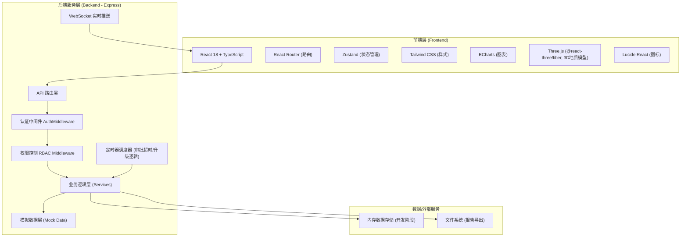
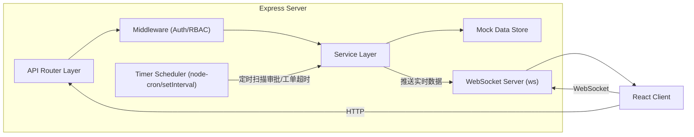
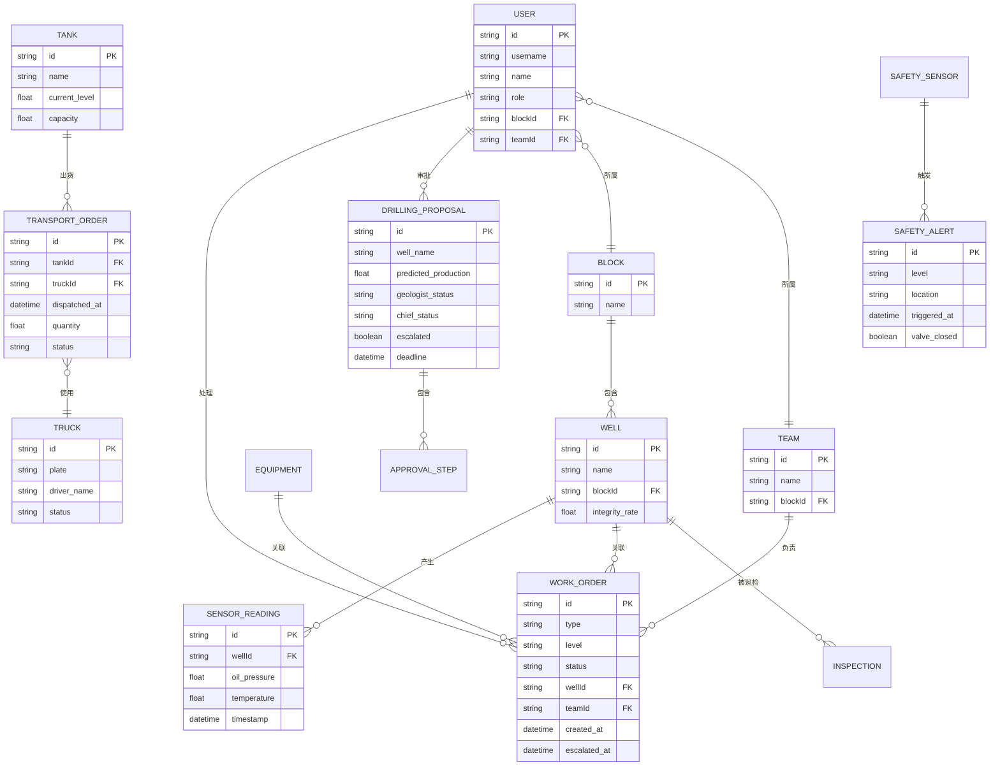

# 油田企业综合管理系统 - 技术架构文档

## 1. 架构设计



---

## 2. 技术栈说明

### 2.1 技术选型
| 层级 | 技术 | 版本 | 用途说明 |
|------|------|------|---------|
| 前端框架 | React | 18.x | UI组件化开发 |
| 前端语言 | TypeScript | 5.x | 类型安全，提升可维护性 |
| 构建工具 | Vite | 5.x | 快速构建，热更新 |
| 路由 | react-router-dom | 6.x | 前端路由，权限路由拦截 |
| 状态管理 | zustand | 4.x | 轻量级状态管理，用户信息/全局状态 |
| UI样式 | Tailwind CSS | 3.x | 原子化CSS，快速构建UI |
| 图表库 | echarts | 5.x | 各类图表：柱状图/折线图/饼图/仪表盘 |
| 3D引擎 | three, @react-three/fiber, @react-three/drei | latest | 地质三维模型渲染 |
| 图标库 | lucide-react | latest | 统一图标组件 |
| 后端框架 | Express | 4.x | REST API服务 |
| 后端语言 | TypeScript | 5.x | 全栈统一类型 |
| HTTP客户端 | fetch API (原生) | - | 前后端数据交互 |
| 实时通信 | ws (WebSocket) | latest | 传感器数据推送/预警通知 |

### 2.2 项目初始化方式
- 使用模板：**react-express-ts**（React + Express + TypeScript 全栈模板）
- 包管理：pnpm（优先）或 npm
- 初始化命令：`pnpm create vite-init@latest . --template react-express-ts --force`

### 2.3 目录结构
```
485/
├── src/                          # 前端源码
│   ├── components/               # 通用UI组件
│   │   ├── Layout.tsx           # 整体布局（顶栏+侧边栏+内容区）
│   │   ├── StatCard.tsx         # 统计卡片组件
│   │   ├── DataTable.tsx        # 通用数据表格
│   │   ├── ApprovalFlow.tsx     # 审批流程组件
│   │   ├── AlertTimeline.tsx    # 预警时间轴
│   │   └── ...
│   ├── pages/                    # 页面组件
│   │   ├── Login.tsx            # 登录页
│   │   ├── Dashboard.tsx        # 首页大屏
│   │   ├── Geology.tsx          # 地质勘探
│   │   ├── Drilling.tsx         # 钻井调度
│   │   ├── Production.tsx       # 采油监控
│   │   ├── Storage.tsx          # 油品储运
│   │   ├── Equipment.tsx        # 设备运维
│   │   ├── Safety.tsx           # 安全环保
│   │   └── System.tsx           # 系统管理
│   ├── hooks/                    # 自定义Hooks
│   │   ├── useAuth.ts           # 认证相关
│   │   ├── useRealtime.ts       # 实时数据订阅
│   │   └── useChartData.ts      # 图表数据处理
│   ├── store/                    # Zustand状态
│   │   ├── useUserStore.ts      # 用户状态
│   │   ├── useAlertStore.ts     # 预警状态
│   │   └── useAppStore.ts       # 全局应用状态
│   ├── utils/                    # 工具函数
│   │   ├── request.ts           # HTTP请求封装
│   │   ├── formatters.ts        # 数据格式化
│   │   └── permissions.ts       # 权限判断
│   ├── types/                    # TypeScript类型定义
│   ├── App.tsx                   # 根组件
│   ├── main.tsx                  # 入口文件
│   └── index.css                 # 全局样式
├── api/                          # 后端源码
│   ├── index.ts                  # Express入口
│   ├── middleware/               # 中间件
│   │   ├── auth.ts              # 认证中间件
│   │   └── rbac.ts              # 权限中间件
│   ├── routes/                   # API路由
│   │   ├── auth.ts              # 认证相关
│   │   ├── dashboard.ts         # 大屏数据
│   │   ├── geology.ts           # 地质勘探
│   │   ├── drilling.ts          # 钻井调度
│   │   ├── production.ts        # 采油监控
│   │   ├── storage.ts           # 油品储运
│   │   ├── equipment.ts         # 设备运维
│   │   ├── safety.ts            # 安全环保
│   │   └── system.ts            # 系统管理
│   ├── services/                 # 业务逻辑
│   │   └── ...
│   ├── data/                     # 模拟数据
│   │   ├── mockUsers.ts         # 模拟用户数据
│   │   ├── mockWells.ts         # 模拟井口数据
│   │   └── ...
│   ├── timers/                   # 定时任务
│   │   ├── approvalEscalation.ts # 审批超时越级
│   │   ├── ticketUpgrade.ts      # 工单超时升级
│   │   └── sensorUpdate.ts       # 模拟传感器数据
│   └── ws/                       # WebSocket
│       └── realtime.ts          # 实时推送服务
├── shared/                       # 前后端共享类型
│   └── types.ts
├── public/                       # 静态资源
├── index.html
├── package.json
├── tsconfig.json
├── vite.config.ts
├── tailwind.config.js
└── postcss.config.js
```

---

## 3. 路由定义

### 3.1 前端路由
| 路由路径 | 页面组件 | 允许角色 | 功能说明 |
|---------|---------|---------|---------|
| `/login` | Login | 全部 | 登录页，无权限限制 |
| `/` | Dashboard | 全部（按权限过滤数据） | 首页大屏，数据总览 |
| `/geology` | Geology | 总部、区块主管、地质专家、总工 | 地质勘探模块 |
| `/drilling` | Drilling | 总部、区块主管、物供经理 | 钻井调度模块 |
| `/production` | Production | 全部（采油工仅见本人井） | 采油监控模块 |
| `/storage` | Storage | 总部、区块主管、储运调度 | 油品储运模块 |
| `/equipment` | Equipment | 全部（按角色过滤） | 设备运维模块 |
| `/safety` | Safety | 总部、区块主管、安全专员 | 安全环保模块 |
| `/system` | System | 总部管理员 | 系统管理（权限/规则配置） |

### 3.2 后端API路由
| HTTP方法 | 路由前缀 | 功能分类 |
|---------|---------|---------|
| POST/GET | `/api/auth` | 登录、登出、获取用户信息 |
| GET | `/api/dashboard` | 获取首页大屏数据、导出报告 |
| GET/POST/PUT | `/api/geology` | 地质数据、井位推荐、审批操作 |
| GET/POST/PUT | `/api/drilling` | 钻井排程、库存、采购审批 |
| GET/POST/PUT | `/api/production` | 传感器数据、工单管理 |
| GET/POST/PUT | `/api/storage` | 罐车调度、路线、转派 |
| GET/POST/PUT | `/api/equipment` | 巡检计划、报修、照片上传 |
| GET/POST/PUT | `/api/safety` | 监测数据、关断操作、预案 |
| GET/POST/PUT/DELETE | `/api/system` | 用户CRUD、角色权限、规则配置 |

---

## 4. API定义（核心接口）

### 4.1 类型定义
```typescript
// shared/types.ts

export type UserRole = 
  | 'oil_worker'      // 采油工
  | 'team_leader'     // 班组长
  | 'block_manager'   // 区块主管
  | 'hq_admin'        // 总部管理员
  | 'geologist'       // 地质专家
  | 'chief_engineer'  // 总工程师
  | 'supply_manager'; // 物供经理

export interface User {
  id: string;
  username: string;
  name: string;
  role: UserRole;
  blockId?: string;      // 所属区块
  teamId?: string;       // 所属班组
  responsibleWells?: string[]; // 负责井口（采油工）
}

export interface AlertLevel = 'normal' | 'warning' | 'danger' | 'critical';

export interface WellData {
  id: string;
  name: string;
  blockId: string;
  oilPressure: number;       // 油压 MPa
  temperature: number;       // 温度 ℃
  status: 'running' | 'stopped' | 'fault';
  integrityRate: number;     // 完好率 %
  dailyProduction: number;   // 日产量 吨
}

export interface WorkOrder {
  id: string;
  type: 'production' | 'equipment' | 'safety';
  level: AlertLevel;
  wellId?: string;
  equipmentId?: string;
  description: string;
  assigneeTeamId: string;
  status: 'pending' | 'confirmed' | 'processing' | 'completed' | 'escalated';
  createdAt: Date;
  confirmedAt?: Date;
  escalatedAt?: Date;
  completedAt?: Date;
  photoUrls?: string[];
}

export interface DrillingProposal {
  id: string;
  wellName: string;
  location: { lat: number; lng: number };
  predictedProduction: number;
  riskLevel: 'low' | 'medium' | 'high';
  geologistApproval: { status: 'pending'|'approved'|'rejected'; time?: Date; comment?: string };
  chiefEngineerApproval: { status: 'pending'|'approved'|'rejected'; time?: Date; comment?: string };
  escalated: boolean;
  createdAt: Date;
  deadline: Date; // 48h后
}
```

### 4.2 核心接口Schema

| 接口 | 请求体 | 响应体 | 说明 |
|-----|-------|-------|-----|
| POST /api/auth/login | `{ username, password }` | `{ token, user: User }` | 登录认证 |
| GET /api/dashboard/stats?blockId= | - | `{ blocks, wells, production, tanks, alerts }` | 获取大屏数据 |
| GET /api/production/sensor-stream | WebSocket | 5秒推送一次 `{ wellId, oilPressure, temperature, timestamp }` | 传感器实时流 |
| PUT /api/production/workorders/:id/confirm | - | `{ success, workOrder }` | 确认接单工单 |
| PUT /api/geology/proposals/:id/approve | `{ role, comment }` | `{ success, proposal }` | 审批钻井方案 |
| POST /api/dashboard/export-report | `{ month, blockId, format }` | `{ downloadUrl }` | 导出月度报告 |

---

## 5. 服务器架构图



---

## 6. 数据模型

### 6.1 ER图



### 6.2 模拟数据初始化
使用 `api/data/mock*.ts` 文件在服务启动时初始化内存数据，包含：
- 6个角色的用户账号各2-3个（密码统一为 `123456`，便于演示）
- 4个区块、每个区块10-15个井口
- 初始钻井方案、工单、储运订单各若干
- 传感器数据通过定时器每5秒模拟更新
